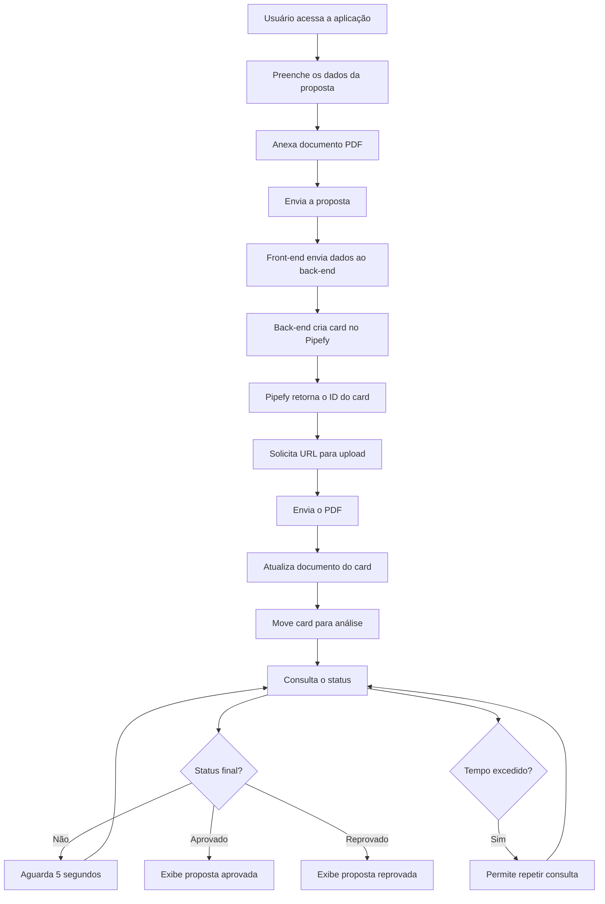

# Documentação técnica — Davison Queiroz

## Visão Geral

### Oque o sistema faz
O usuário informa os dados para envio de proposta no forms, assim como anexa o documento para envio. Ao selecionar o botão de envio de proposta é verificado se todos os campos obrigatórios do forms foram preenchidos. Os dados são extraidos,o front-end enviará os dados para o back-end, que criará o card no pipefy. Feito a criação do card( e exibido o ID do card criado ao usuário), solicitado a Url para envio do documento, realizado o envio do documento e alterado o status do card. A aba referente a consulta de status é selecionada e realizado requisição do status do card. No intervalo de 3 minutos, a cada 5 segundos será feito uma request na rota de Status. Se dentro desse periodo não retornar "Aprovado" ou "Reprovado" , será gerado um botão para refazer a solicitação. Caso seja retornado um dos valores citados, será gerado o resultado com as informações da proposta e o resultado final.

## Diagrama de Fluxo

## Oque faria diferente com mais tempo

- Sistema de login
- Menu para navegação
- Validação de CNPJ e CPF com base no radio button e validação do documento em si
- Histórico de propostas
- front-end mais trabalhado
- Validação de valores passados nos campos do Forms
- Opção de edição e reenvio de proposta

## Uso de IA

IA foi utilizada como apoio durante o desenvolvimento para:

- Definir a arquitetura da aplicação e a separação entre front-end, back-end e integração com o Pipefy.
- Orientar referente ao funcionamento e criação das consultas GraphQL
- Revisar o código e identificar erros de digitação, importações, exportações e problemas de estrutura.
- Sugerir melhorias de validação e organização do código.
- Auxiliar e orientar na compreensão de tópicos onde não havia muita clareza.
